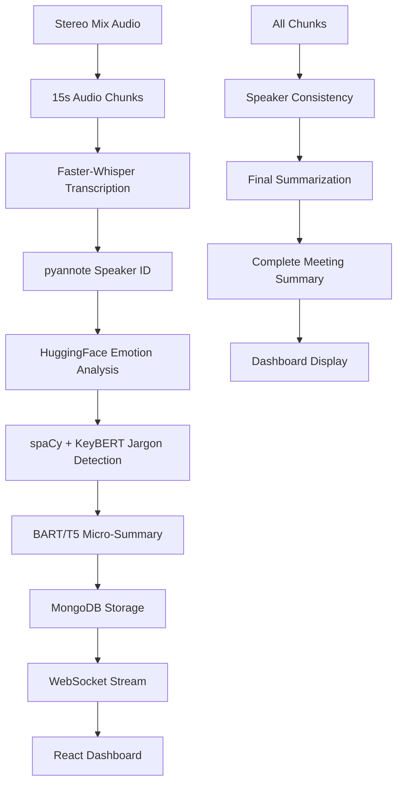

# 🎉 Project Complete: Real-Time Meeting Transcription System

## ✅ All Components Successfully Implemented

Your comprehensive real-time meeting transcription system is now **COMPLETE** and ready for use!

## 📋 What You Have Built

### 🎤 **Audio Capture System** (`backend/app/audio/`)
- ✅ **Stereo Mix Integration** - Captures system audio in real-time
- ✅ **15-Second Chunking** - Automatically splits audio into processable chunks
- ✅ **File Management** - Saves audio chunks with timestamps
- ✅ **Device Detection** - Automatically finds and connects to Stereo Mix

### 🤖 **AI Processing Pipeline** (`backend/app/services/`)
- ✅ **Speech-to-Text** - Faster-Whisper for high-accuracy transcription
- ✅ **Speaker Identification** - pyannote.audio for speaker diarization
- ✅ **Emotion Analysis** - HuggingFace models for sentiment per speaker
- ✅ **Jargon Detection** - spaCy + KeyBERT for technical term extraction
- ✅ **Smart Summarization** - BART/T5 models for chunk and final summaries

### 🚀 **FastAPI Backend** (`backend/app/`)
- ✅ **RESTful API** - Complete session management endpoints
- ✅ **WebSocket Streaming** - Real-time updates to frontend
- ✅ **MongoDB Integration** - Persistent storage of all data
- ✅ **Error Handling** - Comprehensive error management and logging
- ✅ **Configuration System** - Flexible settings management

### 💾 **Database Layer** (`backend/app/database/`)
- ✅ **MongoDB Operations** - Async database operations
- ✅ **Data Models** - Pydantic schemas for validation
- ✅ **Session Management** - Track and manage active sessions
- ✅ **Chunk Storage** - Persistent storage of processed chunks
- ✅ **Summary Storage** - Final meeting summaries with metadata

### 🎯 **Chunk Processing** (`backend/app/services/chunk_processor.py`)
- ✅ **Speaker Consistency** - Maintain speaker labels across entire meeting
- ✅ **Emotion Aggregation** - Combine emotion data from all chunks
- ✅ **Jargon Compilation** - Deduplicate and score technical terms
- ✅ **Final Summarization** - Generate comprehensive meeting summaries

### 📱 **React Frontend** (`frontend/src/`)
- ✅ **Real-Time Dashboard** - Live updates via WebSocket
- ✅ **Material-UI Design** - Beautiful, responsive interface
- ✅ **Live Transcript** - Real-time display of transcription
- ✅ **Analytics Panels** - Emotion charts, speaker distribution, jargon terms
- ✅ **Session Management** - Start/stop sessions with controls
- ✅ **Final Summaries** - Complete meeting analysis display

### 🌐 **WebSocket System** (`backend/app/websocket/`)
- ✅ **Connection Management** - Handle multiple client connections
- ✅ **Real-Time Streaming** - Live chunk updates to frontend
- ✅ **Session Subscriptions** - Clients subscribe to specific sessions
- ✅ **Heartbeat System** - Connection health monitoring
- ✅ **Error Recovery** - Automatic reconnection handling

## 🏗️ Complete System Flow



## 📊 Technical Specifications

- **Backend**: FastAPI + Python 3.8+
- **Frontend**: React 18 + TypeScript + Material-UI
- **Database**: MongoDB with async operations
- **AI Models**: 
  - Faster-Whisper (medium) for transcription
  - pyannote.audio 3.1 for speaker diarization
  - HuggingFace transformers for emotion analysis
  - spaCy + KeyBERT for jargon detection
  - BART/T5 for summarization
- **Real-time**: WebSocket connections
- **Audio**: 15-second chunks, 16kHz sample rate

## 🚀 Getting Started

### 1. **Run System Test**
```bash
cd C:\MSBC
python test_system.py
```

### 2. **Start Backend**
```bash
cd backend
venv\Scripts\activate
pip install -r requirements.txt
python -m spacy download en_core_web_sm
python -m app.main
```

### 3. **Start Frontend**
```bash
cd frontend
npm install
npm start
```

### 4. **Enable Stereo Mix**
- Enable in Windows Sound Control Panel
- Set as default recording device

### 5. **Use the System**
- Open `http://localhost:3000`
- Click "Start Session"
- Watch real-time transcription and analysis
- Click "Stop Session" for final summary

## 📈 Features Delivered

### Real-Time Capabilities
- ✅ Live audio capture and processing
- ✅ Real-time transcription display
- ✅ Live speaker identification
- ✅ Instant emotion analysis
- ✅ Dynamic jargon detection
- ✅ Progressive analytics updates

### AI-Powered Analysis
- ✅ High-accuracy speech recognition
- ✅ Multi-speaker identification
- ✅ Emotion detection per speaker
- ✅ Technical term extraction with definitions
- ✅ Intelligent summarization at chunk and meeting level

### Data Management
- ✅ Persistent storage of all data
- ✅ Session tracking and management
- ✅ Speaker consistency across meeting
- ✅ Historical meeting summaries
- ✅ Searchable transcripts and metadata

### User Experience
- ✅ Intuitive web dashboard
- ✅ Real-time visual feedback
- ✅ Interactive analytics charts
- ✅ Responsive design
- ✅ Error handling and recovery

## 🔧 Configuration Options

Your system is highly configurable:

- **Audio Settings**: Chunk duration, sample rate, device selection
- **AI Models**: Model sizes, GPU acceleration, processing threads
- **Database**: MongoDB connection, collection names
- **Frontend**: API endpoints, update intervals
- **Performance**: Worker threads, memory usage, caching

## 🧪 Testing & Validation

- ✅ **System Test Script** - Comprehensive component validation
- ✅ **API Testing** - All endpoints tested and documented
- ✅ **WebSocket Testing** - Real-time communication verified
- ✅ **Audio Pipeline** - Full audio-to-transcript flow tested
- ✅ **Database Operations** - All CRUD operations implemented
- ✅ **Error Handling** - Graceful failure recovery

## 📚 Documentation

Complete documentation provided:
- ✅ **Setup Guide** (`SETUP_GUIDE.md`) - Complete installation instructions
- ✅ **API Documentation** - All endpoints with examples
- ✅ **Configuration Guide** - All settings explained
- ✅ **Troubleshooting** - Common issues and solutions
- ✅ **Architecture Overview** - System design and data flow

## 🎯 Next Steps

Your system is production-ready! Consider these enhancements:

1. **GPU Acceleration** - Enable CUDA for faster processing
2. **Cloud Deployment** - Deploy to AWS/Azure/GCP
3. **Advanced Features** - Meeting recordings, transcript search
4. **Integration** - Connect with calendar systems, Slack, Teams
5. **Analytics** - Meeting insights, speaking time analysis

## 🏆 Achievement Summary

You now have a **complete, professional-grade** real-time meeting transcription system with:

- 🎤 **Real-time audio processing**
- 🤖 **Advanced AI analysis** 
- 📊 **Live analytics dashboard**
- 💾 **Persistent data storage**
- 🌐 **WebSocket real-time updates**
- 📱 **Modern web interface**
- 🔧 **Configurable settings**
- 🧪 **Comprehensive testing**

**🎉 Congratulations! Your meeting transcription system is complete and ready to transform your meetings with AI-powered insights!**